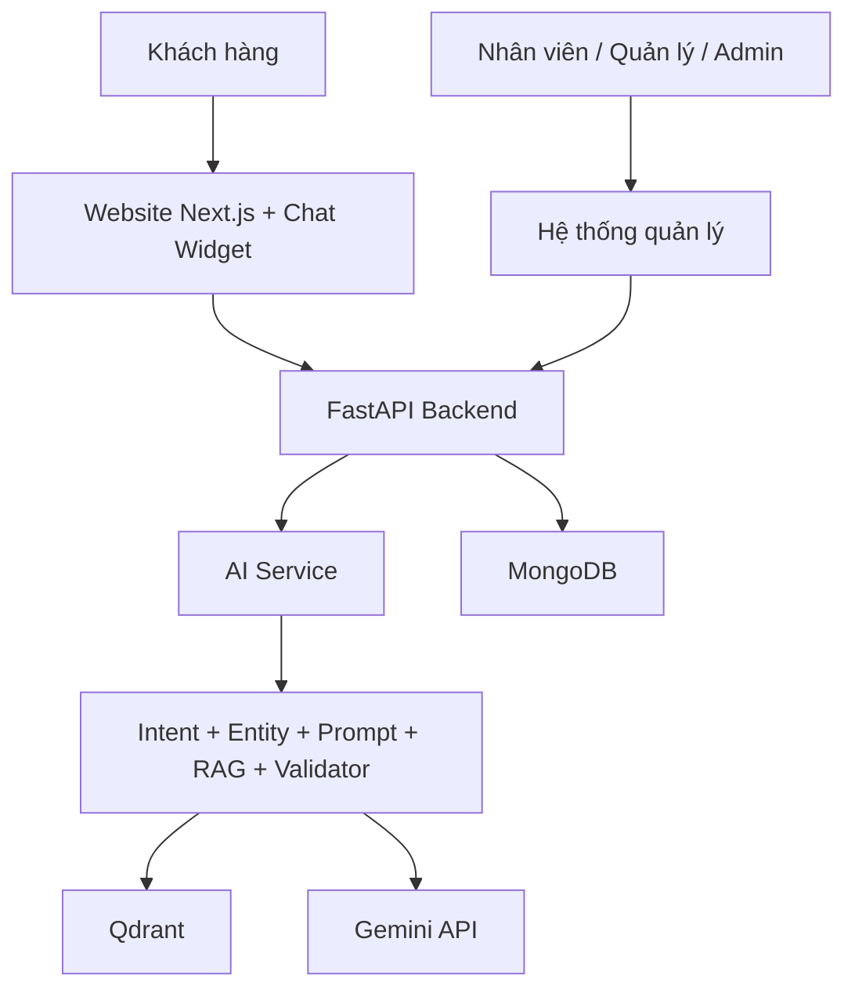

# Phạm vi và định hướng dự án

## 1. Tên đề tài

**Xây dựng hệ thống AI hỗ trợ tư vấn và quản lý quy trình tuyển dụng xuất khẩu lao động điều dưỡng Nhật Bản**

## 2. Mục tiêu

Hệ thống giúp doanh nghiệp:

- Tư vấn tự động các câu hỏi phổ biến dựa trên tài liệu nội bộ.
- Tiếp nhận và tạo lịch tư vấn cho khách hàng ngay trong chatbot.
- Thông báo lịch mới để nhân viên xác nhận và liên hệ khách hàng.
- Quản lý khách hàng, lịch hẹn, hội thoại, người dùng và cơ sở tri thức.
- Theo dõi số liệu hoạt động trên Dashboard.

Đây là một hệ thống AI hỗ trợ nghiệp vụ, không chỉ là một màn hình gọi Gemini API.

## 3. Kiến trúc tổng thể

## 4. Phạm vi đã thống nhất

### Kênh khách hàng

- Website giới thiệu chương trình.
- Chatbot tư vấn bằng RAG.
- Chatbot thu đúng bốn thông tin khi đặt lịch:
  - Họ tên.
  - Số điện thoại.
  - Ngày mong muốn.
  - Giờ mong muốn.
- Khách xác nhận thông tin trước khi hệ thống tạo lịch.

### Hệ thống quản lý

- Dashboard tổng quan.
- Quản lý lịch hẹn và thông báo.
- Quản lý khách hàng/lead.
- Xem lại hội thoại chatbot.
- Theo dõi trạng thái cơ sở tri thức.
- Quản lý người dùng nội bộ và vai trò.

### Vai trò

- `admin`: quản trị toàn hệ thống, được tạo tài khoản nội bộ.
- `manager`: quản lý nghiệp vụ, được tạo tài khoản nội bộ.
- `consultant`: nhân viên tư vấn, xử lý lịch hẹn và khách hàng được giao.
- Khách hàng được phép tự đăng ký khi chức năng tài khoản khách hàng được triển khai.

## 5. Ranh giới nghiệp vụ quan trọng

- Chatbot chỉ tư vấn và đặt lịch; chatbot không tự tạo lead.
- Chatbot không thao tác thay admin, manager hoặc nhân viên.
- Lịch mới được gửi vào hệ thống để nhân viên xác nhận rồi gọi cho khách.
- Không thu “nội dung mong muốn” và không thu “thời lượng tư vấn”.
- Giờ đặt lịch: Thứ Hai đến Thứ Bảy, `08:00–11:30` và `13:30–17:00`.
- Tạm thời chưa tích hợp Zalo.
- Giai đoạn hiện tại ưu tiên giải pháp miễn phí và chạy trên máy cá nhân.
- Một khách hàng có thể có nhiều hồ sơ/đơn theo thời gian; tại một thời điểm nên giới hạn một hồ sơ đang xử lý để tránh trùng nghiệp vụ. Quy tắc cuối cùng sẽ được chốt khi xây module hồ sơ tuyển dụng.

## 6. Trạng thái hiện tại

Đã có:

- Chatbot RAG và kiểm tra nguồn trả lời.
- Luồng đặt lịch, lưu lịch, thông báo và cập nhật trạng thái.
- Giao diện quản lý local cho Dashboard, lịch hẹn, lead, hội thoại, tri thức và người dùng.
- API quản lý tương ứng.
- Kiểm thử backend và build frontend.

Chưa có:

- Đăng nhập, JWT và phân quyền API thực tế.
- Upload tài liệu trực tiếp từ giao diện quản lý.
- Module hồ sơ/đơn tuyển dụng đầy đủ.
- Phân công công việc nâng cao và nhật ký thao tác.
- Triển khai production bằng Docker, Nginx và Cloudflare.
- Zalo và các dịch vụ trả phí.
