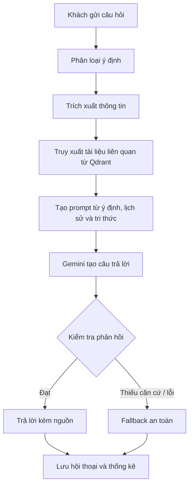
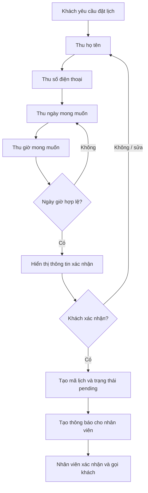
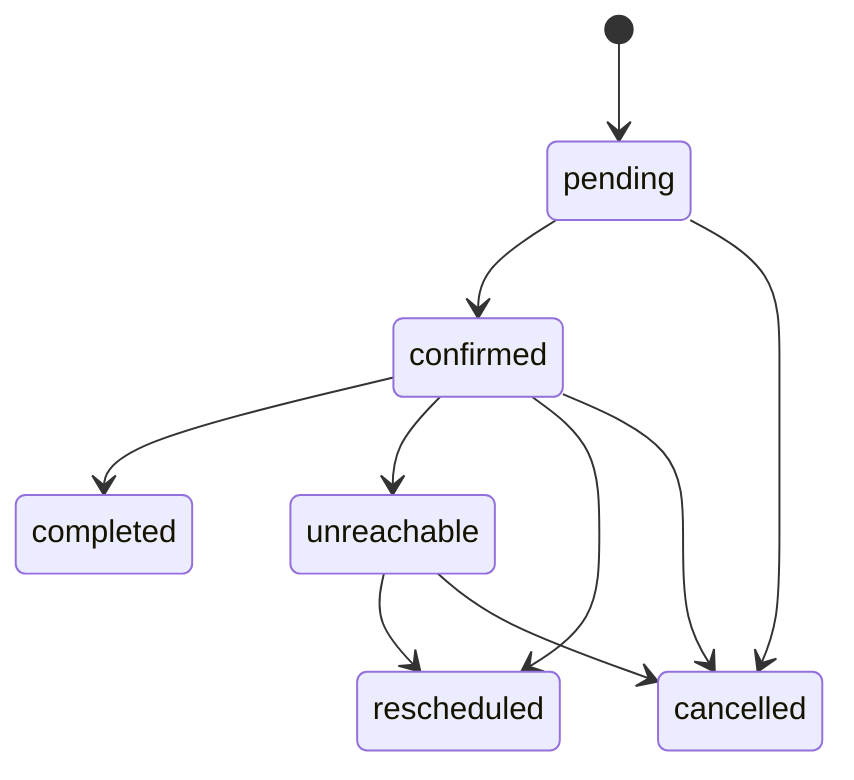
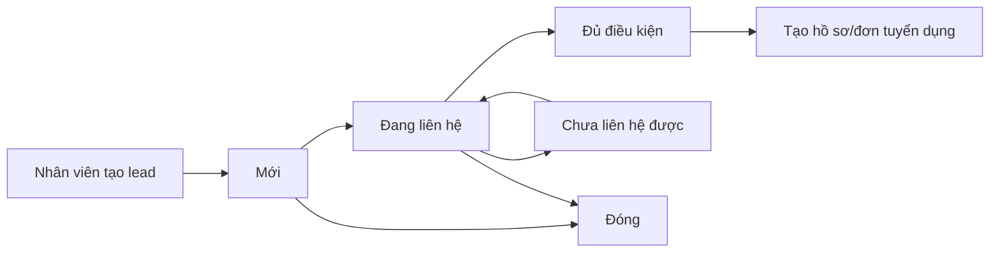
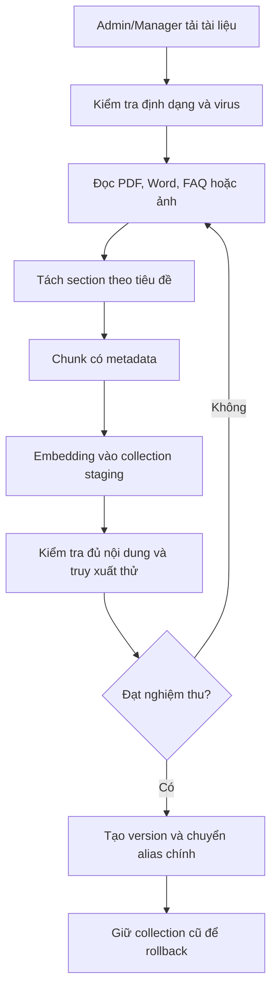
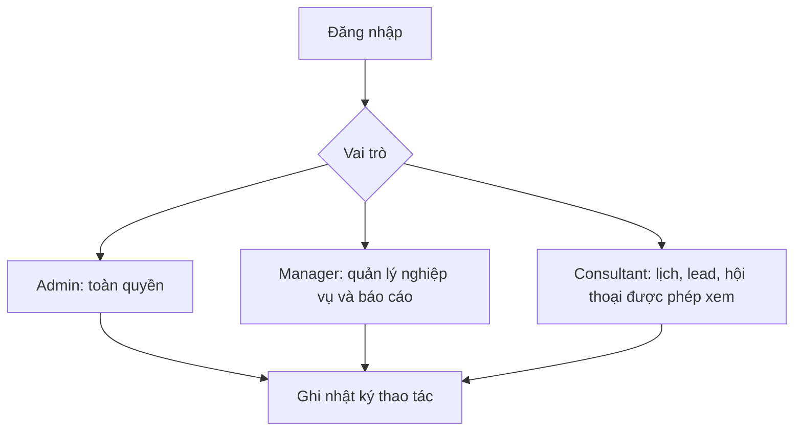

# Workflow nghiệp vụ

## 1. Luồng tư vấn bằng AI

Nguyên tắc:

- Chỉ trả lời theo cơ sở tri thức của doanh nghiệp.
- Ưu tiên đúng tiêu đề và đúng section của tài liệu.
- Không bịa thông tin khi kết quả truy xuất yếu.
- Giới hạn lịch sử đưa vào prompt để tiết kiệm hạn mức miễn phí.

## 2. Luồng chatbot đặt lịch

Trạng thái lịch:

## 3. Luồng xử lý lịch của nhân viên

1. Nhân viên mở danh sách lịch mới.
2. Hệ thống hiển thị mã lịch, tên, số điện thoại, ngày và giờ.
3. Nhân viên kiểm tra và chuyển lịch sang `confirmed`.
4. Nhân viên gọi khách bằng số điện thoại đã thu.
5. Sau liên hệ, nhân viên cập nhật:
   - `completed`: đã tư vấn xong.
   - `unreachable`: chưa liên hệ được.
   - `rescheduled`: đã đổi lịch.
   - `cancelled`: lịch bị hủy.

## 4. Luồng quản lý khách hàng/lead

Lưu ý: lịch do chatbot tạo không tự biến thành lead. Nhân viên quyết định tạo lead sau khi xác nhận nhu cầu thực tế.

## 5. Luồng quản lý tri thức

## 6. Luồng người dùng và phân quyền dự kiến

Phân quyền phải được kiểm tra tại backend; ẩn nút trên giao diện không được xem là bảo mật.

Nhật ký hệ thống:

- Ghi đăng nhập thành công/thất bại, đăng xuất và đổi mật khẩu.
- Ghi thao tác tạo/cập nhật tài khoản, khách hàng và lịch hẹn.
- Chỉ `admin` và `manager` được xem; `consultant` không có quyền truy cập API.
- Không lưu mật khẩu, token, nội dung ghi chú khách hàng hoặc giá trị dữ liệu nhạy cảm.
- Hỗ trợ lọc theo người thao tác, hành động, kết quả và khoảng ngày.

Quyền đối với lịch hẹn:

- `admin` và `manager` xem toàn bộ lịch, phân công hoặc chuyển người phụ trách.
- `consultant` chỉ xem và cập nhật lịch có `assigned_to` trùng email tài khoản của mình.
- Lịch chưa phân công chỉ hiển thị cho `admin` và `manager`.
- `consultant` không được tự nhận lịch hoặc xem lịch sử xử lý của lịch thuộc người khác.

## 7. Luồng tổng hợp Dashboard

Dashboard đọc dữ liệu từ MongoDB để hiển thị:

- Số khách hàng/lead.
- Số hội thoại.
- Lịch mới và lịch theo trạng thái.
- Ý định phổ biến.
- Câu hỏi/fallback phổ biến.
- Tỷ lệ chuyển đổi theo từng giai đoạn.
- Hiệu quả xử lý của nhân viên khi module phân công hoàn thiện.
