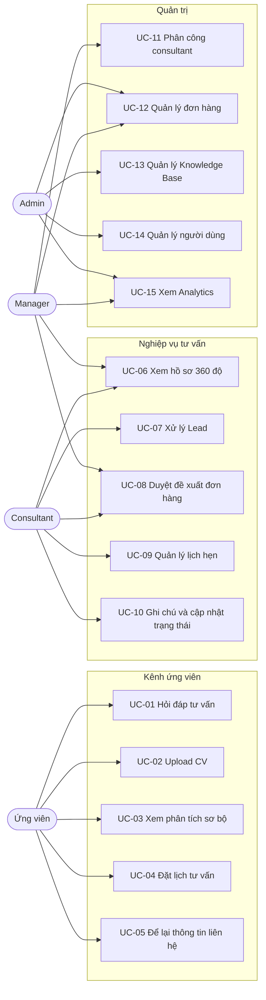

# 02 — Use Case

## 1. Sơ đồ Use Case tổng thể



## 2. Ma trận phân quyền

| Use Case | Ứng viên | Consultant | Manager | Admin |
|---|:--:|:--:|:--:|:--:|
| UC-01..05 Kênh ứng viên | ✅ | – | – | – |
| UC-06 Xem hồ sơ 360° | – | Chỉ được giao | Toàn bộ | Toàn bộ |
| UC-07 Xử lý Lead | – | Chỉ được giao | Toàn bộ | Toàn bộ |
| UC-08 Duyệt đề xuất | – | ✅ | ✅ | ✅ |
| UC-09 Quản lý lịch hẹn | – | Chỉ được giao | Toàn bộ | Toàn bộ |
| UC-11 Phân công | – | ❌ | ✅ | ✅ |
| UC-12 Quản lý đơn hàng | – | Chỉ xem | ✅ | ✅ |
| UC-13 Knowledge Base | – | Chỉ xem | Chỉ xem | ✅ |
| UC-14 Quản lý người dùng | – | ❌ | ❌ | ✅ |
| UC-15 Analytics | – | Số liệu cá nhân | ✅ | ✅ |

---

## 3. Đặc tả use case chính

### UC-01 — Hỏi đáp tư vấn

| Mục | Nội dung |
|---|---|
| **Actor** | Ứng viên |
| **Mục tiêu** | Nhận câu trả lời chính xác dựa trên tài liệu doanh nghiệp |
| **Tiền điều kiện** | Widget đã tải, Knowledge Base đã vector hóa |
| **Hậu điều kiện** | Message được lưu, session cập nhật, intent/entity ghi nhận |

**Luồng chính**
1. Ứng viên nhập câu hỏi vào Chat Widget.
2. Hệ thống tạo hoặc lấy `session_id`.
3. Intent Classifier xác định ý định (1 trong 10 nhóm).
4. Entity Extractor bóc tách thực thể; hợp nhất vào Consultation Profile tạm.
5. RAG Retriever embed câu hỏi, tìm Top-4 chunk có score ≥ 0.65 trong Qdrant.
6. Prompt Builder ghép: system prompt + context + lịch sử 6 lượt gần nhất + câu hỏi.
7. Gemini sinh câu trả lời.
8. Response Validator kiểm tra câu trả lời có bám context không, tính `confidence`.
9. Trả về `{reply, intent, entities, suggested_actions, confidence, sources}`.

**Luồng thay thế**
- *A1 — Không có chunk nào ≥ 0.65:* trả lời fallback, không gọi Gemini sinh nội dung
  tự do, gợi ý để lại SĐT, đánh dấu `is_fallback = true`.
- *A2 — Gemini lỗi sau 3 lần retry:* trả về thông điệp xin lỗi cố định, ghi log ERROR.
- *A3 — `confidence < 0.65` hoặc ứng viên yêu cầu gặp người:* kích hoạt UC-05 với
  trạng thái `NEED_CONTACT`.

---

### UC-02 — Upload CV

| Mục | Nội dung |
|---|---|
| **Actor** | Ứng viên |
| **Mục tiêu** | Hệ thống đọc CV và tạo Candidate Profile |
| **Tiền điều kiện** | Có `session_id` hợp lệ |
| **Hậu điều kiện** | `documents` lưu file, `candidate_profiles` được tạo/cập nhật |

**Luồng chính**
1. Ứng viên bấm nút kẹp giấy trong widget, chọn file.
2. Frontend validate: định dạng `pdf/docx/jpg/png`, kích thước ≤ 10MB.
3. `POST /api/v1/documents/upload` (multipart) → backend lưu file, tạo bản ghi
   `documents` với `status = UPLOADED`, trả `document_id` ngay (202).
4. BackgroundTask: `PARSING` → trích text (PyMuPDF / python-docx / Gemini Vision OCR).
5. `ANALYZING` → gọi LLM sinh Candidate Profile theo JSON schema cố định.
6. Ghi `candidate_profiles`, đặt `documents.status = DONE`.
7. Frontend poll `GET /api/v1/documents/{id}` mỗi 2s, hiện thanh tiến trình.
8. Khi `DONE` → widget hiển thị thẻ tóm tắt hồ sơ để ứng viên xác nhận/sửa.

**Luồng thay thế**
- *A1 — File không đọc được text (ảnh mờ, PDF scan hỏng):* `status = FAILED`,
  thông báo "Em chưa đọc được file này, anh/chị gửi lại giúp em nhé".
- *A2 — LLM trả JSON sai schema:* retry 1 lần với prompt sửa lỗi; vẫn sai →
  `status = PARTIAL`, chỉ lưu text thô để nhân viên đọc tay.
- *A3 — Ứng viên sửa thông tin trong thẻ tóm tắt:* ghi đè field đó,
  đặt `source = "user_confirmed"`, `confidence = 1.0`.

---

### UC-03 — Xem phân tích sơ bộ và đơn hàng gợi ý

**Luồng chính**
1. Sau UC-02, hệ thống có Candidate Profile + Consultation Profile.
2. Matching Engine lọc `job_orders` đang mở theo ngành + địa điểm.
3. Chấm điểm từng đơn (xem [07_AI_PIPELINE](07_AI_PIPELINE.md) §4).
4. Lấy Top-3, gọi LLM sinh câu giải thích lý do phù hợp cho từng đơn.
5. Lưu `recommendations`, hiển thị thẻ đơn hàng trong widget.

**Ràng buộc**: điểm hiển thị cho ứng viên ở dạng nhãn (Cao / Trung bình / Thấp),
không hiện số thô để tránh hiểu nhầm là cam kết trúng tuyển.

---

### UC-04 — Đặt lịch tư vấn

**Luồng chính**
1. Ứng viên bấm "Đặt lịch tư vấn" hoặc AI nhận diện intent `DANG_KY`.
2. Hệ thống thu đúng 4 trường: họ tên, SĐT, ngày, giờ.
3. Kiểm tra khung giờ hợp lệ (T2–T7, 08:00–11:30 / 13:30–17:00).
4. Hiển thị bảng xác nhận, ứng viên bấm "Xác nhận".
5. Tạo `consultation_appointments` + `notifications` cho nhân viên.
6. Nếu chưa có Candidate → tạo mới; nếu SĐT đã tồn tại → gắn vào Candidate cũ.

**Luồng thay thế**
- *A1 — Khung giờ đã kín:* đề xuất 3 khung gần nhất còn trống.
- *A2 — SĐT sai định dạng:* yêu cầu nhập lại, tối đa 3 lần rồi chuyển `NEED_CONTACT`.

---

### UC-06 — Xem hồ sơ ứng viên 360°

**Luồng chính**
1. Nhân viên mở `Candidates` → chọn ứng viên.
2. Hệ thống gọi `GET /api/v1/candidates/{id}/overview` trả về một payload gồm:
   thông tin cá nhân, danh sách CV, Candidate Profile, Consultation Profile,
   danh sách đề xuất, lịch sử hội thoại, lịch hẹn, ghi chú, dòng thời gian.
3. Giao diện hiển thị theo tab.

**Quy tắc hiển thị**: mọi trường do AI sinh phải có nhãn nguồn
(`AI` / `Người dùng xác nhận` / `Nhân viên nhập`) và tooltip hiện `evidence`.

---

### UC-07 — Xử lý Lead

**Luồng chính**
1. Consultant mở danh sách Lead, lọc `NEED_CONTACT` / `URGENT`.
2. Mở Lead → đọc Phiếu tổng hợp tư vấn do AI sinh (không cần đọc hết chat).
3. Gọi điện cho ứng viên.
4. Ghi kết quả cuộc gọi vào `notes`, chuyển trạng thái sang `CONTACTED`.
5. Ghi `audit_logs`.

**Quy tắc trạng thái**

```
NEW ──────────────► CONTACTED
 │                     ▲
 ├──► NEED_CONTACT ────┤
 └──► URGENT ──────────┘
```
- `NEW`: có thông tin nhưng chưa cần gấp.
- `NEED_CONTACT`: AI không trả lời được, hoặc ứng viên yêu cầu gặp người.
- `URGENT`: ứng viên đã nộp CV + có đơn hàng match Cao, hoặc đã đặt lịch.
- `CONTACTED`: đã liên hệ thành công, có ghi chú kết quả.
- Chuyển ngược từ `CONTACTED` về trạng thái khác cần lý do bắt buộc.

---

### UC-13 — Quản lý Knowledge Base

**Luồng chính**
1. Admin vào màn hình Knowledge Base, bấm Upload, chọn PDF/DOCX.
2. `POST /api/v1/knowledge/upload` → lưu file, tạo `knowledge_documents`
   với `status = PENDING`, trả về ngay.
3. BackgroundTask: Parse → Chunk (500 token, overlap 10%) → Embed → Upsert Qdrant.
4. Cập nhật `status` theo từng bước; frontend poll hiển thị thanh tiến trình.
5. Admin có thể sửa metadata (topic, tiêu đề) trước khi bấm "Vector hóa lại".

**Luồng thay thế**
- *A1 — Upsert Qdrant lỗi:* `status = FAILED`, giữ nguyên chunk cũ, cho phép retry.
- *A2 — Xóa tài liệu:* xóa toàn bộ point trong Qdrant theo filter `document_id`
  rồi mới xóa bản ghi Mongo (thứ tự này tránh chunk mồ côi).
