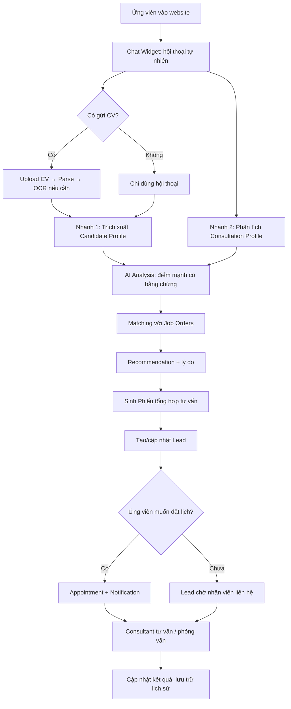
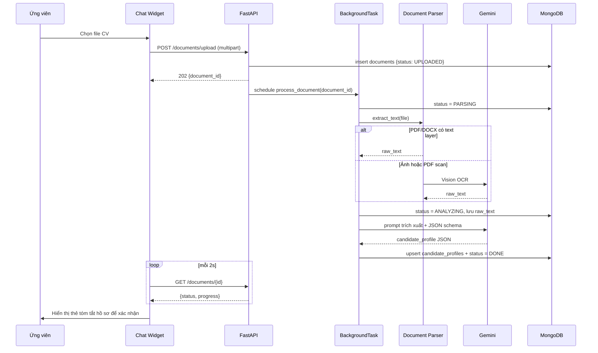
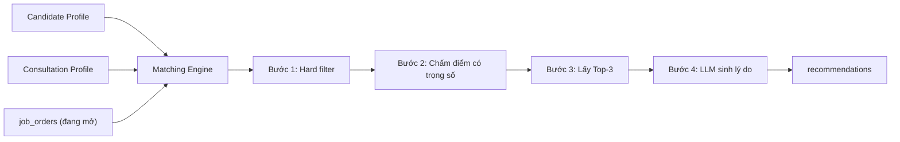
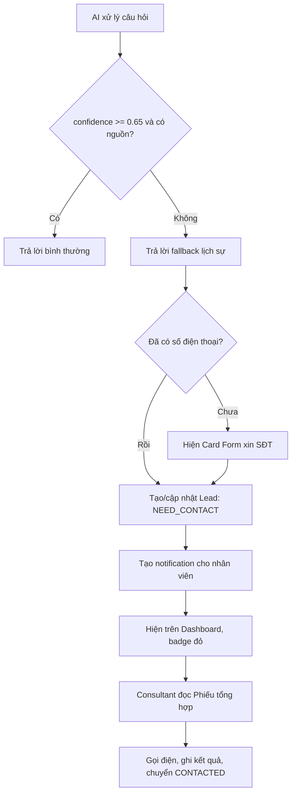

# 03 — Workflow nghiệp vụ

## 1. Luồng giá trị cốt lõi

```
CHAT + CV  →  EXTRACTION  →  STRUCTURED PROFILE  →  ANALYSIS
          →  MATCHING  →  RECOMMENDATION  →  LEAD  →  APPOINTMENT
          →  HUMAN CONSULTANT
```

Mỗi mũi tên là một bước có thể kiểm chứng, có lưu vết trong database.
Đây là điểm khác biệt so với một chatbot thuần: chatbot dừng ở mũi tên thứ nhất.

## 2. Workflow tổng thể



## 3. Nhánh 1 — Phân tích ứng viên (CV → Candidate Profile)



**Quy tắc trích xuất**

| Trường | Nguồn ưu tiên | Xử lý |
|---|---|---|
| `full_name` | CV > chat | Chuẩn hóa hoa đầu từ |
| `phone` | chat > CV | Regex VN, chuẩn hóa về `0xxxxxxxxx` |
| `birth_year` / `age` | CV | Suy từ năm sinh, không đoán |
| `education_level`, `major` | CV | Ánh xạ về danh mục chuẩn |
| `experience_years` | CV | Tính từ mốc thời gian, làm tròn xuống |
| `japanese_level` | chat > CV | Enum `N1..N5`, `CHUA_HOC`, `KHONG_RO` |
| `care_experience` | CV | Boolean + trích dẫn dòng chứng minh |
| `skills[]` | CV | Chỉ lấy kỹ năng được nêu tường minh |
| `desired_location` | chat | Danh mục tỉnh Nhật Bản |

**Ràng buộc chống suy diễn**: mỗi field kèm object
`{value, confidence, source: "cv"|"chat"|"user_confirmed"|"staff", evidence: "..."}`.
Nếu LLM không tìm được `evidence`, field bắt buộc trả `null` — không được đoán.
Prompt cấm sinh các tính từ đánh giá tính cách ("kiên nhẫn", "chịu khó", "tận tâm").

## 4. Nhánh 2 — Phân tích nhu cầu (Chat → Consultation Profile)

```
Lịch sử hội thoại (n lượt gần nhất)
            ↓
   Intent Classifier (10 nhóm)
            ↓
   Entity Extractor (rule + LLM)
            ↓
   Need Analyzer (LLM, chạy khi hội thoại ≥ 3 lượt hoặc có sự kiện quan trọng)
            ↓
   Consultation Profile
```

Cấu trúc Consultation Profile:

| Trường | Ví dụ |
|---|---|
| `purpose` | "Đi Nhật làm việc" |
| `interested_industry` | "Điều dưỡng" |
| `priorities[]` | ["Công việc ổn định"] |
| `desired_location` | "Tokyo" |
| `reason` | "Có người thân tại Tokyo" |
| `concerns[]` | ["Lo chi phí ban đầu"] |
| `stage` | `DANG_TIM_HIEU` / `DANG_CAN_NHAC` / `SAN_SANG_DANG_KY` |

**Thời điểm chạy lại**: khi ứng viên gửi tin nhắn thứ 3, 6, 10... hoặc ngay sau
khi upload CV, hoặc khi entity mới xuất hiện. Không chạy mỗi lượt để tiết kiệm quota.

## 5. Matching và Recommendation



- **Hard filter** (loại thẳng): đơn đã đóng, ngành không thuộc nhóm quan tâm,
  tuổi ngoài khoảng, giới tính không khớp yêu cầu bắt buộc.
- **Chấm điểm**: xem [07_AI_PIPELINE](07_AI_PIPELINE.md) §4 — điểm được tính bằng
  **code Python thuần**, không hỏi LLM, để kết quả nhất quán và giải thích được.
- **LLM chỉ diễn giải** kết quả đã chấm thành câu tiếng Việt, không được đổi điểm.

## 6. Human Handoff (bất đồng bộ)



Câu fallback chuẩn: *"Em chưa có thông tin chính xác về nội dung này. Chuyên viên
tư vấn sẽ liên hệ lại với anh/chị ngay để giải đáp cụ thể hơn ạ."*

Không làm Live Chat realtime trong phạm vi đồ án.

## 7. Vòng đời Lead và Appointment

```
Ứng viên ẩn danh (session)
   │ có SĐT
   ▼
Candidate (dedup theo phone)
   │
   ├── Lead (NEW / NEED_CONTACT / URGENT)
   │      │ consultant gọi
   │      ▼
   │   CONTACTED
   │
   └── Appointment (PENDING → CONFIRMED → COMPLETED / NO_SHOW / CANCELLED)
```

**Quy tắc gộp danh tính**: khi ứng viên cung cấp SĐT, hệ thống tìm
`candidates.phone`. Nếu trùng → gắn `session_id` hiện tại vào candidate cũ và
hợp nhất Profile (giá trị `user_confirmed` thắng giá trị `AI`, mới thắng cũ).
Nếu không trùng → tạo candidate mới.

## 8. Workflow quản trị Knowledge Base

```
Admin upload PDF/DOCX
   ↓ PENDING
Parse text (PyMuPDF / python-docx)
   ↓ PARSING
Chunk 500 token, overlap 50 token, giữ tiêu đề section làm metadata
   ↓ CHUNKING
Embed từng chunk (gemini-embedding-001), batch 20 chunk/lần
   ↓ EMBEDDING
Upsert Qdrant với payload {document_id, topic, title, section, text, source}
   ↓ INDEXED
Sẵn sàng cho RAG
```

Khi cập nhật lại tài liệu: xóa toàn bộ point có `document_id` cũ trước khi upsert
bản mới, tránh trả về nội dung lỗi thời.
