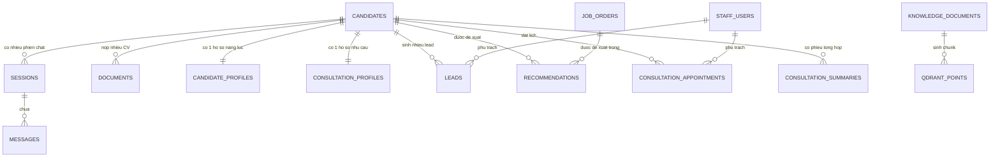

# 04 — Thiết kế Database

## 1. Tổng quan

- **MongoDB** (`xkld_chatbot`): dữ liệu nghiệp vụ có cấu trúc.
- **Qdrant** (`xkld_knowledge`): vector của Knowledge Base.
- **Volume `./storage`**: file gốc (CV, tài liệu KB), không public ra internet.

Nguyên tắc: dữ liệu có cấu trúc (tên, SĐT, trình độ, kinh nghiệm) lưu MongoDB.
Chỉ nội dung cần tìm kiếm ngữ nghĩa mới đưa vào Qdrant. **CV không đẩy vào Qdrant**
ở giai đoạn này — không có nhu cầu semantic search trên CV.

## 2. Sơ đồ quan hệ



## 3. Collection MongoDB

### 3.1 `candidates` — bản ghi gốc của ứng viên

```json
{
  "_id": "ObjectId",
  "candidate_code": "UV-20260903-0001",
  "full_name": "Nguyen Van A",
  "phone": "0912345678",
  "phone_normalized": "0912345678",
  "email": "a@example.com",
  "birth_year": 2000,
  "gender": "male",
  "session_ids": ["sess_abc", "sess_def"],
  "source": "chat_widget",
  "current_stage": "CONSULTING",
  "assigned_to": "ObjectId(staff_users)",
  "tags": ["N4", "co_kinh_nghiem"],
  "is_active": true,
  "created_at": "ISODate",
  "updated_at": "ISODate"
}
```

Index: `phone_normalized` unique sparse; `candidate_code` unique;
`(current_stage, updated_at DESC)`; text index trên `full_name`.

**Quy tắc dedup**: chuẩn hóa SĐT qua `app/core/phone.py` (đã có) rồi mới ghi.
Unique index ở tầng database là chốt chặn cuối, không chỉ dựa vào check ở service.

### 3.2 `candidate_profiles` — hồ sơ năng lực do AI trích xuất

```json
{
  "_id": "ObjectId",
  "candidate_id": "ObjectId",
  "version": 3,
  "fields": {
    "education_level": {
      "value": "Cao dang",
      "confidence": 0.95,
      "source": "cv",
      "evidence": "Cao dang Y te Ha Noi, 2018-2021"
    },
    "major": { "value": "Dieu duong", "confidence": 0.98, "source": "cv", "evidence": "..." },
    "experience_years": { "value": 2, "confidence": 0.9, "source": "cv", "evidence": "..." },
    "japanese_level": { "value": "N4", "confidence": 1.0, "source": "user_confirmed", "evidence": "..." },
    "care_experience": { "value": true, "confidence": 0.92, "source": "cv", "evidence": "..." }
  },
  "skills": [
    { "name": "Cham soc nguoi cao tuoi", "evidence": "2 nam tai Vien duong lao X" }
  ],
  "work_history": [
    { "company": "Vien duong lao X", "role": "Dieu duong vien", "from": "2021-08", "to": "2023-09" }
  ],
  "strengths": [
    { "text": "Co nen tang dao tao dieu duong chinh quy", "evidence": "Bang Cao dang Dieu duong" }
  ],
  "suitable_job_groups": ["dieu_duong", "cham_soc_nguoi_cao_tuoi", "ho_ly"],
  "source_document_ids": ["ObjectId"],
  "generated_by": "gemini-2.5-flash",
  "created_at": "ISODate",
  "updated_at": "ISODate"
}
```

Index: `candidate_id` unique. Phiên bản cũ ghi sang `candidate_profile_history`.

**Ràng buộc bắt buộc**: `strengths[].evidence` không được rỗng. Service phải
validate và loại bỏ phần tử không có evidence trước khi ghi — đây là cơ chế kỹ thuật
thực thi yêu cầu FR-B07 (AI không suy diễn).

### 3.3 `consultation_profiles` — hồ sơ nhu cầu

```json
{
  "_id": "ObjectId",
  "candidate_id": "ObjectId",
  "session_id": "sess_abc",
  "purpose": "Di Nhat lam viec",
  "interested_industry": "Dieu duong",
  "priorities": ["Cong viec on dinh"],
  "desired_location": "Tokyo",
  "reason": "Co nguoi than tai Tokyo",
  "concerns": ["Lo chi phi ban dau"],
  "stage": "DANG_TIM_HIEU",
  "evidence_messages": ["ObjectId(messages)"],
  "updated_at": "ISODate"
}
```

`stage` thuộc `DANG_TIM_HIEU | DANG_CAN_NHAC | SAN_SANG_DANG_KY`.

### 3.4 `documents` — CV và tài liệu ứng viên

```json
{
  "_id": "ObjectId",
  "candidate_id": "ObjectId | null",
  "session_id": "sess_abc",
  "doc_type": "CV",
  "original_filename": "CV_NguyenVanA.pdf",
  "stored_path": "storage/cv/2026/09/uuid.pdf",
  "mime_type": "application/pdf",
  "size_bytes": 482113,
  "checksum_sha256": "...",
  "status": "DONE",
  "progress": 100,
  "raw_text": "...",
  "page_count": 2,
  "extraction_method": "pymupdf",
  "error_message": null,
  "created_at": "ISODate",
  "processed_at": "ISODate"
}
```

`status` thuộc `UPLOADED | PARSING | ANALYZING | DONE | PARTIAL | FAILED`.
Index: `(session_id, created_at DESC)`, `candidate_id`, `checksum_sha256`
(phát hiện upload trùng file).

### 3.5 `job_orders` — đơn hàng

```json
{
  "_id": "ObjectId",
  "order_code": "DH-2026-018",
  "title": "Dieu duong vien duong lao Tokyo",
  "industry": "dieu_duong",
  "job_group": "cham_soc_nguoi_cao_tuoi",
  "location": { "prefecture": "Tokyo", "region": "Kanto" },
  "quantity": 20,
  "requirements": {
    "japanese_level_min": "N4",
    "education_min": "trung_cap",
    "age_min": 20, "age_max": 35,
    "gender": "any",
    "experience_years_min": 1,
    "care_experience_required": true
  },
  "salary": { "min": 180000, "max": 220000, "currency": "JPY", "period": "month" },
  "benefits": ["Ho tro ky tuc xa", "Bao an ca"],
  "interview_date": "ISODate",
  "deadline": "ISODate",
  "status": "OPEN",
  "created_by": "ObjectId(staff_users)",
  "created_at": "ISODate",
  "updated_at": "ISODate"
}
```

`status` thuộc `DRAFT | OPEN | CLOSED | FILLED`.
Index: `order_code` unique; `(status, deadline)`; `(industry, location.prefecture)`.

### 3.6 `recommendations` — kết quả matching

```json
{
  "_id": "ObjectId",
  "candidate_id": "ObjectId",
  "job_order_id": "ObjectId",
  "score": 0.87,
  "level": "CAO",
  "breakdown": {
    "industry": 1.0, "japanese": 1.0, "experience": 0.8,
    "education": 1.0, "location": 1.0, "age": 1.0
  },
  "matched_reasons": [
    "Co bang Cao dang Dieu duong, dap ung yeu cau trinh do toi thieu",
    "Trinh do N4 dung bang muc yeu cau cua don hang",
    "Co 2 nam kinh nghiem cham soc nguoi cao tuoi"
  ],
  "gaps": ["Don hang uu tien ung vien co N3, ung vien hien o N4"],
  "explanation": "Ung vien phu hop voi don hang do ...",
  "status": "SUGGESTED",
  "reviewed_by": null,
  "review_note": null,
  "created_at": "ISODate"
}
```

`level`: `CAO` (score >= 0.75) | `TRUNG_BINH` (0.5–0.75) | `THAP` (< 0.5).
`status` thuộc `SUGGESTED | ACCEPTED | REJECTED`.
Index: `(candidate_id, score DESC)`; `(job_order_id, status)`.

### 3.7 `consultation_summaries` — phiếu tổng hợp tư vấn

```json
{
  "_id": "ObjectId",
  "candidate_id": "ObjectId",
  "summary_text": "...",
  "sections": {
    "candidate_info": "...", "needs": "...", "strengths": "...",
    "suggestion": "...", "next_action": "..."
  },
  "top_recommendation_ids": ["ObjectId"],
  "appointment_id": "ObjectId | null",
  "generated_at": "ISODate",
  "generated_by": "gemini-2.5-flash",
  "is_stale": false
}
```

`is_stale = true` khi Profile thay đổi sau lần sinh gần nhất, Dashboard hiện nút
"Tạo lại phiếu".

### 3.8 `leads`

```json
{
  "_id": "ObjectId",
  "lead_code": "LEAD-20260903-0007",
  "candidate_id": "ObjectId",
  "session_id": "sess_abc",
  "status": "NEED_CONTACT",
  "priority": "HIGH",
  "trigger_reason": "AI fallback: confidence 0.41 o cau hoi ve visa",
  "source": "chat_widget",
  "assigned_to": "ObjectId | null",
  "notes": [
    { "by": "ObjectId", "text": "Da goi, khach ban, hen goi lai 19h",
      "created_at": "ISODate" }
  ],
  "status_history": [
    { "from": "NEW", "to": "NEED_CONTACT", "by": "system",
      "reason": "...", "at": "ISODate" }
  ],
  "created_at": "ISODate",
  "updated_at": "ISODate"
}
```

`status` thuộc `NEW | NEED_CONTACT | CONTACTED | URGENT`.
Index: `(status, updated_at DESC)`; `(assigned_to, status)`; `candidate_id`.

### 3.9 Collection đã có, giữ nguyên

| Collection | Vai trò | Thay đổi cần làm |
|---|---|---|
| `sessions` | Phiên chat | Thêm `candidate_id` |
| `messages` | Tin nhắn | Thêm `intent`, `confidence`, `is_fallback`, `sources[]` |
| `consultation_appointments` | Lịch hẹn | Thêm `candidate_id` |
| `staff_users` | Tài khoản nội bộ | Không đổi |
| `audit_logs` | Nhật ký thao tác | Bổ sung action mới |
| `notifications` | Thông báo nhân viên | Bổ sung loại `NEW_LEAD`, `CV_ANALYZED` |
| `analytics` | Số liệu theo ngày | Thêm chỉ số CV/recommendation |
| `recruitment_applications` | Hồ sơ tuyển dụng | Liên kết `candidate_id` |

### 3.10 `knowledge_documents` — tài liệu Knowledge Base

```json
{
  "_id": "ObjectId",
  "title": "Bang chi phi chuong trinh dieu duong 2026",
  "doc_type": "PDF",
  "topic": "chi_phi",
  "stored_path": "storage/kb/uuid.pdf",
  "source_url": null,
  "status": "INDEXED",
  "progress": 100,
  "chunk_count": 42,
  "vector_synced_at": "ISODate",
  "error_message": null,
  "uploaded_by": "ObjectId",
  "created_at": "ISODate"
}
```

`status` thuộc `PENDING | PARSING | CHUNKING | EMBEDDING | INDEXED | FAILED`.

### 3.11 `faqs`

```json
{
  "_id": "ObjectId", "question": "...", "answer": "...",
  "topic": "chi_phi", "is_active": true,
  "vector_synced": true, "updated_by": "ObjectId", "updated_at": "ISODate"
}
```

## 4. Qdrant

**Collection `xkld_knowledge`**

| Thuộc tính | Giá trị |
|---|---|
| Vector size | 768 (`gemini-embedding-001`, `outputDimensionality=768`) |
| Distance | Cosine |
| Point ID | UUID v5 sinh từ `document_id + chunk_index` (idempotent khi re-index) |

Payload:
```json
{
  "document_id": "...", "chunk_index": 7, "topic": "chi_phi",
  "title": "...", "section": "...", "text": "...",
  "source": "kb_upload | website_crawl | faq", "source_url": "...",
  "updated_at": "..."
}
```

Payload index: `topic` (keyword), `document_id` (keyword), `source` (keyword).

**Tham số RAG chốt**: chunk 500 token, overlap 50 token (10%),
`score_threshold = 0.65`, `Top-K = 4`.

## 5. Migration cần thực hiện

| # | Việc | Rủi ro | Cách làm |
|---|---|---|---|
| M1 | Đổi `managed_leads` thành `candidates` | Trung bình | Script copy sang collection mới, giữ collection cũ 1 tuần rồi mới xóa |
| M2 | Thêm `candidate_id` vào `sessions`, `messages`, `consultation_appointments` | Thấp | Backfill theo `phone_normalized` |
| M3 | Chuẩn hóa `leads.status` về 4 giá trị | Thấp | Ánh xạ giá trị cũ, log bản ghi không ánh xạ được |
| M4 | Đổi taxonomy `topic` trong Qdrant sang 10 nhóm intent | **Cao** | Phải re-embed lại 32 bài. Xem [10_GAP_ANALYSIS](10_GAP_ANALYSIS.md) |
| M5 | Tạo index mới | Thấp | Thêm vào `init_db()`, chạy tự động lúc khởi động |

Toàn bộ script migration đặt tại `backend/scripts/migrations/`, đánh số tăng dần,
mỗi script phải chạy lại được nhiều lần mà không hỏng dữ liệu (idempotent).
