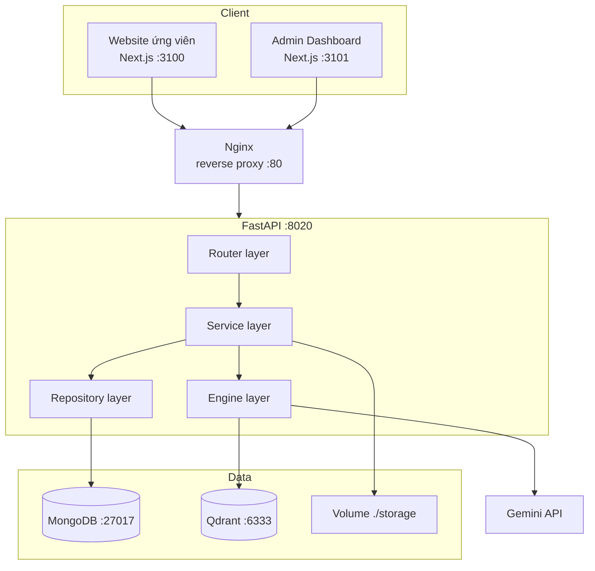

# 08 — Kiến trúc hệ thống

## 1. Kiến trúc tổng thể



## 2. Phân tầng backend

| Tầng | Trách nhiệm | Được phép gọi | Cấm |
|---|---|---|---|
| **Router** | Nhận HTTP, validate Pydantic, kiểm tra quyền, ánh xạ lỗi thành HTTP | Service | Gọi thẳng DB hoặc LLM |
| **Service** | Điều phối nghiệp vụ, transaction logic | Engine, Repository | Biết về `Request`/`Response` |
| **Engine** | Xử lý AI: intent, entity, retriever, matching, parser | LLM client, Vector store | Ghi DB nghiệp vụ |
| **Repository** | Truy vấn MongoDB, ánh xạ document ↔ model | Motor | Chứa logic nghiệp vụ |

Quy tắc kiểm tra nhanh: nếu một file `api/*.py` có `import motor` hoặc gọi
`gemini`, tầng đã bị vi phạm.

## 3. Cấu trúc thư mục mục tiêu

```
xkld-chatbot/
├── docker-compose.yml
├── docker-compose.prod.yml
├── .env.example
├── nginx/
│   ├── nginx.conf
│   └── conf.d/default.conf
├── storage/                      # volume: CV và tài liệu KB
│   ├── cv/
│   └── kb/
│
├── backend/
│   ├── Dockerfile
│   ├── requirements.txt
│   ├── main.py
│   ├── app/
│   │   ├── api/                  # Router layer
│   │   │   ├── deps.py           # dependency: get_current_user, require_role
│   │   │   ├── auth.py
│   │   │   ├── chat.py
│   │   │   ├── documents.py      # MỚI
│   │   │   ├── candidates.py     # MỚI
│   │   │   ├── analysis.py       # MỚI
│   │   │   ├── recommendations.py# MỚI
│   │   │   ├── job_orders.py     # MỚI
│   │   │   ├── knowledge.py      # MỚI
│   │   │   ├── leads.py
│   │   │   ├── appointments.py
│   │   │   ├── analytics.py
│   │   │   ├── management.py
│   │   │   └── audit.py
│   │   ├── schemas/              # MỚI: Pydantic v2, tách khỏi router
│   │   │   ├── common.py
│   │   │   ├── chat.py
│   │   │   ├── candidate.py
│   │   │   ├── document.py
│   │   │   ├── job_order.py
│   │   │   ├── lead.py
│   │   │   └── analytics.py
│   │   ├── services/             # Service layer
│   │   │   ├── chat_service.py
│   │   │   ├── rag_service.py           # MỚI: facade RAG
│   │   │   ├── document_service.py      # MỚI
│   │   │   ├── candidate_service.py     # MỚI
│   │   │   ├── analysis_service.py      # MỚI
│   │   │   ├── matching_service.py      # MỚI
│   │   │   ├── summary_service.py       # MỚI
│   │   │   ├── knowledge_service.py     # MỚI
│   │   │   ├── lead_service.py
│   │   │   ├── booking_service.py
│   │   │   ├── analytics_service.py
│   │   │   └── audit_service.py
│   │   ├── engines/              # Engine layer
│   │   │   ├── intent_classifier.py
│   │   │   ├── entity_extractor.py
│   │   │   ├── reference_resolver.py
│   │   │   ├── response_validator.py
│   │   │   ├── retriever.py
│   │   │   ├── prompt_builder.py
│   │   │   ├── matching_engine.py       # MỚI: chấm điểm bằng code
│   │   │   ├── document_parser.py       # MỚI: PDF/DOCX/OCR
│   │   │   └── chunker.py               # MỚI
│   │   ├── repositories/         # MỚI: Repository layer
│   │   │   ├── base.py
│   │   │   ├── candidate_repo.py
│   │   │   ├── document_repo.py
│   │   │   ├── lead_repo.py
│   │   │   ├── job_order_repo.py
│   │   │   └── knowledge_repo.py
│   │   ├── llm/
│   │   │   ├── gemini_client.py  # httpx.AsyncClient + retry + circuit breaker
│   │   │   └── prompts/          # MỚI: prompt tách ra file riêng
│   │   │       ├── chat_system.txt
│   │   │       ├── cv_extraction.txt
│   │   │       ├── need_analysis.txt
│   │   │       └── match_explain.txt
│   │   ├── db/
│   │   │   ├── mongodb.py
│   │   │   └── qdrant.py
│   │   ├── core/
│   │   │   ├── config.py         # Pydantic Settings
│   │   │   ├── security.py
│   │   │   ├── logging.py        # MỚI: log JSON có request_id
│   │   │   ├── exceptions.py     # MỚI: exception nghiệp vụ + handler
│   │   │   ├── phone.py
│   │   │   └── rate_limit.py
│   │   └── workers/              # MỚI: BackgroundTask
│   │       ├── document_worker.py
│   │       └── knowledge_worker.py
│   ├── scripts/
│   │   ├── seed_admin.py
│   │   ├── seed_job_orders.py
│   │   └── migrations/
│   └── tests/
│       ├── fixtures/             # CV mẫu, bộ test intent
│       ├── unit/
│       └── integration/
│
├── frontend/                     # Website ứng viên
│   ├── Dockerfile
│   ├── app/
│   ├── components/{ui,chat,sections}/
│   ├── hooks/
│   └── lib/{api.ts,types.ts,format.ts}
│
├── admin-frontend/               # Dashboard nội bộ
│   ├── Dockerfile
│   ├── app/(auth)/login/
│   ├── app/admin/{candidates,leads,documents,recommendations,job-orders,
│   │              appointments,conversations,knowledge,analytics,users}/
│   ├── components/admin/
│   ├── hooks/
│   └── lib/
│
└── docs/
    ├── design/                   # bộ tài liệu này
    ├── handoff/                  # tài liệu bàn giao giữa hai phần
    ├── SCOPE_PHAT_TRIEN.md
    ├── KIEM_THU.md
    └── DOCKER.md
```

## 4. Docker Compose

```
services:
  mongodb    → volume mongo_data,   healthcheck: mongosh ping
  qdrant     → volume qdrant_data,  healthcheck: GET /readyz
  backend    → depends_on mongodb + qdrant (condition: service_healthy)
               mount ./storage
  frontend   → depends_on backend
  admin      → depends_on backend
  nginx      → depends_on tất cả, expose :80
```

Nginx định tuyến:

| Path | Đích |
|---|---|
| `/` | `frontend:3100` |
| `/admin` | `admin-frontend:3101` |
| `/api` | `backend:8020` |
| `/api/v1/documents/upload`, `/api/v1/knowledge/upload` | backend, `client_max_body_size 10M` |

Dev dùng `docker-compose.yml` (mount code, hot reload).
Prod dùng `docker-compose.prod.yml` (build image, `--workers 4`, không mount code).

## 5. Cấu hình và biến môi trường

```
# LLM
GEMINI_API_KEY=
GEMINI_MODEL=gemini-2.5-flash
EMBEDDING_MODEL=gemini-embedding-001

# Database
MONGODB_URI=mongodb://mongodb:27017
MONGODB_DB_NAME=xkld_chatbot
QDRANT_URL=http://qdrant:6333
QDRANT_COLLECTION_NAME=xkld_knowledge

# RAG
MIN_RETRIEVAL_SCORE=0.65
RAG_TOP_K=4
CHUNK_SIZE=500
CHUNK_OVERLAP=50

# Auth
JWT_SECRET=
JWT_EXPIRE_MINUTES=480
AUTH_COOKIE_NAME=xkld_admin_session
AUTH_COOKIE_SECURE=false

# Storage
STORAGE_PATH=/app/storage
MAX_UPLOAD_MB=10

# App
CORS_ORIGINS=http://localhost:3100,http://localhost:3101
LOG_LEVEL=INFO
```

Chuyển `core/config.py` từ `dataclass` sang `pydantic_settings.BaseSettings` để
được validate lúc khởi động: thiếu `GEMINI_API_KEY` hoặc `JWT_SECRET` thì ứng dụng
phải chết ngay, không chạy tiếp rồi lỗi mơ hồ ở request đầu tiên.

## 6. Logging và quan sát

- Log JSON một dòng: `timestamp, level, request_id, path, user_id, event, duration_ms`.
- Middleware sinh `request_id` (UUID4), trả về trong header `X-Request-ID`.
- Bắt buộc log riêng cho mọi lệnh gọi ngoài:
  `llm.call` (model, tokens, retry_count, duration), `qdrant.search` (top_score, hits).
- **Che dữ liệu cá nhân**: SĐT log dạng `0912****78`, không log toàn văn CV.
- `GET /health` kiểm tra Mongo + Qdrant, dùng cho healthcheck của Docker.

## 7. Bảo mật

| Hạng mục | Biện pháp |
|---|---|
| Mật khẩu | PBKDF2-HMAC-SHA256, ≥ 200k vòng, salt riêng từng tài khoản |
| Token | JWT HS256, hết hạn 8 giờ, lưu httpOnly cookie |
| Phân quyền | Dependency `require_role(...)` ở tầng router, kiểm tra lại quyền sở hữu ở service |
| Upload | Whitelist MIME + kiểm tra magic bytes, đổi tên file thành UUID, lưu ngoài web root |
| Rate limit | `/chat/message` 20/phút/session; `/auth/login` 5/phút/IP |
| CORS | Whitelist theo biến môi trường, không dùng `*` |
| Injection | Motor dùng tham số hóa; không ghép chuỗi query |
| Dữ liệu cá nhân | API xóa toàn bộ dữ liệu ứng viên theo yêu cầu; CV không public URL |

## 8. Quyết định kiến trúc và lý do

| Quyết định | Lý do | Đánh đổi |
|---|---|---|
| MongoDB thay vì PostgreSQL | Profile do AI sinh có schema linh hoạt, hay đổi trong quá trình làm | Mất ràng buộc quan hệ, phải tự đảm bảo toàn vẹn ở tầng service |
| Matching bằng code, không dùng LLM chấm điểm | Nhất quán, kiểm thử được, giải thích được khi bảo vệ | Kém linh hoạt hơn với tiêu chí lạ |
| CV không đưa vào Qdrant | Không có nhu cầu semantic search trên CV; tránh rò rỉ dữ liệu cá nhân vào vector store dùng chung | Sau này nếu cần tìm ứng viên theo mô tả tự do thì phải bổ sung |
| Xử lý CV bằng BackgroundTask thay vì Celery | Đủ cho quy mô đồ án, ít thành phần vận hành | Task mất nếu tiến trình restart; chấp nhận vì có nút chạy lại |
| Hai app Next.js tách rời | Ứng viên và nội bộ có yêu cầu bảo mật khác nhau | Trùng lặp một ít code UI |
| Giữ Next.js thay vì React thuần | SSR tốt cho SEO trang landing; repo đã có sẵn | Không có; đề cương ghi "React.js" vẫn đúng vì Next.js là framework React |
