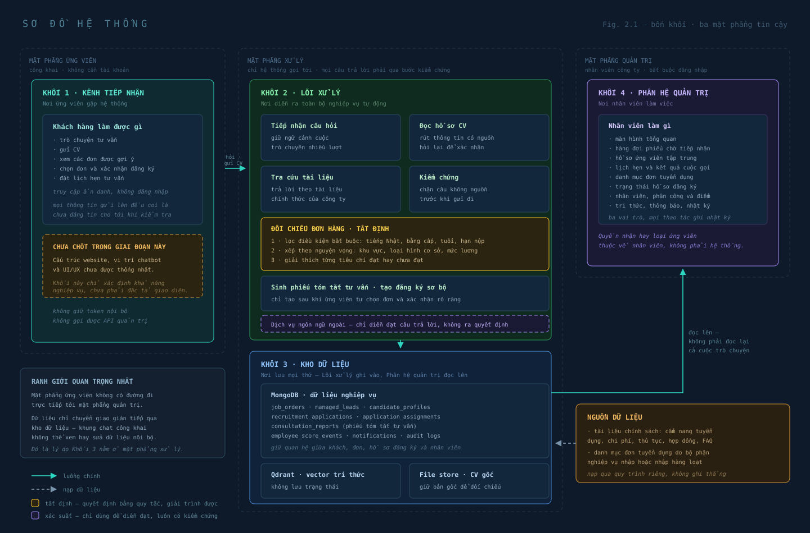
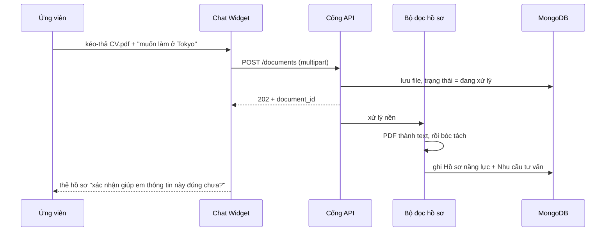
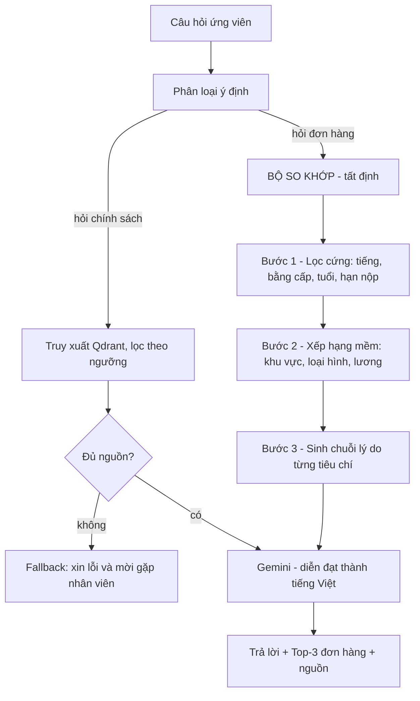
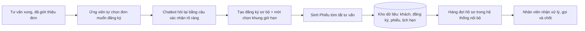

# 11 — Kiến trúc tổng quan hệ thống

> Tài liệu này trả lời ba câu hỏi mà hội đồng chắc chắn sẽ hỏi:
> **Bài toán là gì?** — **Dữ liệu đi qua đâu?** — **Ai (hay cái gì) ra quyết định?**

---

## 1. Phát biểu bài toán

### 1.1. Bản chất

Doanh nghiệp phái cử nhận **đầu vào phi cấu trúc** (câu chat viết tự do, file CV
PDF/DOCX mỗi người một mẫu) và phải biến nó thành **quyết định nghiệp vụ có cấu trúc**
(ứng viên này đủ điều kiện đơn hàng nào, ai gọi, gọi lúc mấy giờ).

Việc chuyển đổi đó hiện do con người làm thủ công: đọc CV, hỏi lại bằng cấp, dò file
Excel đơn hàng. Mất 20–30 phút mỗi ứng viên và **dừng hẳn ngoài giờ hành chính** —
đúng khoảng thời gian ứng viên rảnh để nhắn tin.

### 1.2. Định nghĩa hình thức

| | Nội dung |
|---|---|
| **Đầu vào** | `M` = chuỗi tin nhắn ngôn ngữ tự nhiên; `D` = tài liệu CV (PDF/DOCX); `T` = thời điểm gửi (có thể ngoài giờ) |
| **Tri thức** | `K` = kho tài liệu chính sách công ty (phi cấu trúc); `J` = danh mục đơn hàng đang tuyển (có cấu trúc) |
| **Đầu ra cho ứng viên** | Câu trả lời có dẫn nguồn từ `K`; Top-N đơn hàng từ `J` kèm **lý do**; lịch hẹn đã ghi nhận |
| **Đầu ra cho nội bộ** | Hồ sơ ứng viên chuẩn hóa; Lead; Phiếu tóm tắt tư vấn; lịch hẹn có người phụ trách |
| **Ràng buộc cứng** | (R1) Không bịa — mọi phát ngôn phải truy được về `K`, `J` hoặc lời ứng viên. (R2) Không suy diễn cảm tính khi bóc tách hồ sơ. (R3) Mọi đề xuất phải giải trình được từng bước. (R4) AI không chốt hồ sơ — quyền quyết định cuối thuộc về nhân viên. |
| **Tiêu chí thành công** | Ứng viên có câu trả lời và gợi ý đơn hàng trong vài giây, bất kể giờ nào; nhân viên vào ca mở một màn hình là đủ ngữ cảnh để nhấc máy, không cần đọc lại lịch sử chat |

### 1.3. Điểm khó thật sự (giá trị học thuật)

Nếu để một LLM đọc CV rồi tự phán "đơn hàng nào hợp", hệ thống sẽ vi phạm cả R1, R3
lẫn R4: nó có thể bỏ qua yêu cầu N3, bịa mức lương, và không giải thích được vì sao.

Đề tài giải quyết bằng cách **tách đôi bản chất tri thức**:

| | Tri thức phi cấu trúc `K` | Dữ liệu có cấu trúc `J` |
|---|---|---|
| Nội dung | Chính sách, chi phí, visa, quy trình | Đơn hàng: khu vực, loại hình, yêu cầu tiếng, lương |
| Lưu ở | Qdrant (vector) | MongoDB (bản ghi) |
| Cơ chế | **RAG** — xác suất, cần bộ kiểm chứng chặn hậu | **Bộ so khớp** — tất định, giải trình từng bước |
| Vai trò LLM | Diễn đạt lại nội dung đã truy xuất | **Chỉ diễn đạt kết quả**, không tham gia quyết định |

> **Nguyên tắc trung tâm của kiến trúc:**
> LLM là *bề mặt ngôn ngữ*, không phải *bộ ra quyết định*.
> Bộ so khớp lọc và xếp hạng bằng luật tường minh; LLM chỉ chuyển kết quả đó thành câu tiếng Việt.
> Nhờ vậy mọi đề xuất đều tái lập được và giải trình được — kể cả khi tắt LLM đi.

---

## 2. Ba mặt phẳng · Bốn khối



*Fig. 2.1 — Bốn khối chức năng phân bố trên ba mặt phẳng tin cậy.*
*(Bản `.svg` để chèn vào Word/PowerPoint; bản `.png` @2x cùng thư mục dùng khi công cụ không đọc được SVG.)*

### 2.1. Ba mặt phẳng (phân theo mức tin cậy)

| Mặt phẳng | Ai truy cập | Xác thực | Nguyên tắc |
|---|---|---|---|
| **Ứng viên** | Công khai, người lạ | Không | Không bao giờ lộ dữ liệu nội bộ; mọi input coi là không đáng tin |
| **Xử lý** (Khối 2 + 3) | Chỉ hệ thống gọi tới | Nội bộ tiến trình | Không tin input; mọi câu trả lời phải qua bước kiểm chứng |
| **Quản trị** | Nhân viên công ty | JWT + RBAC ba vai trò | Mọi thao tác ghi đều vào nhật ký |

Ranh giới quan trọng: **mặt phẳng ứng viên không bao giờ chạm trực tiếp mặt phẳng
quản trị.** Dữ liệu chỉ đi qua bằng cách lõi AI ghi vào kho dữ liệu, rồi phân hệ
quản trị đọc lên. Đây là lý do chatbot không thể bị lợi dụng để đọc hay sửa dữ liệu nội bộ.

### 2.2. Bốn khối

Bốn khối phân bố trên ba mặt phẳng: Khối 1 ở mặt phẳng ứng viên, **Khối 2 và Khối 3
cùng ở mặt phẳng xử lý**, Khối 4 ở mặt phẳng quản trị.

| Khối | Vai trò | Gồm những gì |
|---|---|---|
| **1 · Kênh tiếp nhận** | Nơi ứng viên gặp hệ thống | Kênh công khai kết nối chatbot: trò chuyện tư vấn, gửi CV, xem đơn được gợi ý, chọn đơn và xác nhận đăng ký, đặt lịch hẹn. Không phần nào đòi tài khoản đăng nhập |
| **2 · Lõi xử lý** | Nơi diễn ra toàn bộ nghiệp vụ tự động | Tiếp nhận câu hỏi, đọc hồ sơ CV, tra cứu tài liệu, đối chiếu đơn hàng, kiểm chứng câu trả lời, sinh phiếu tóm tắt |
| **3 · Kho dữ liệu** | Nơi lưu mọi thứ | Hồ sơ ứng viên, khách tiềm năng, đơn hàng, lịch hẹn, hội thoại, tài liệu tri thức, bản CV gốc, nhật ký |
| **4 · Phân hệ quản trị** | Nơi nhân viên làm việc | Màn hình tổng quan, hàng đợi phiếu, hồ sơ tập trung, lịch hẹn, danh mục đơn tuyển dụng, trạng thái hồ sơ, nhân viên và điểm, nhật ký |

### 2.3. Kênh khách hàng (Khối 1) — phạm vi nghiệp vụ, chưa phải đặc tả giao diện

Khách hàng truy cập kênh công khai **mà không cần tài khoản**. Chatbot là điểm chạm
chính; các khả năng dưới đây là thứ đã chốt.

**Phạm vi nghiệp vụ đã chốt**

- Tư vấn theo tài liệu doanh nghiệp và duy trì ngữ cảnh cuộc trò chuyện.
- Nhận CV, cho khách xác nhận thông tin và lựa chọn đơn mong muốn.
- Tạo đăng ký sơ bộ, lịch hẹn và phiếu tóm tắt bàn giao cho nhân viên.

**Phần chưa chốt**

- Sơ đồ trang, bố cục từng màn hình, màu sắc thương hiệu và cách nhúng chatbot.
- Luồng điều hướng, thiết kế trên điện thoại và nội dung chi tiết các trang giới thiệu.

> **Lưu ý khi trình bày:** mục này chỉ xác định *khả năng nghiệp vụ* của kênh khách hàng.
> Không mô tả sitemap hay đặc tả giao diện — phần đó thuộc giai đoạn thiết kế UI/UX.

Quy tắc nghiệp vụ dự kiến: nếu kênh khách hàng có danh mục đơn, hệ thống **chỉ công khai
đơn đã được duyệt và đang tuyển**. Cách trình bày danh mục sẽ thống nhất sau.

### 2.4. Hệ thống quản trị nội bộ (Khối 4)

Ứng dụng riêng, mọi màn hình đều nằm sau đăng nhập.

| Màn hình | Nội dung |
|---|---|
| Tổng quan | Khách mới, phiếu chờ tiếp nhận, lịch hẹn hôm nay |
| Hàng đợi hồ sơ | Nhận xử lý, phân công, chuyển người phụ trách |
| Hồ sơ ứng viên | CV gốc, thông tin đã rút ra, hội thoại, đơn đã chọn, lịch hẹn, lịch sử trạng thái |
| Lịch hẹn | Lọc, phân công, đổi lịch, ghi kết quả cuộc gọi |
| Danh mục đơn tuyển dụng | Thêm, sửa, bật tắt công khai, nhập hàng loạt |
| Nhật ký giới thiệu | Hệ thống đã gợi ý gì cho ai và vì sao |
| Nhân viên và hiệu suất | Tài khoản, khối lượng, thời gian phản hồi, điểm |
| Hội thoại · Tri thức | Xem lại cuộc trò chuyện; quản lý tài liệu và trạng thái cập nhật |
| Nhật ký thao tác | Ai đã làm gì, thời điểm và lý do |

Ba vai trò: **nhân viên tư vấn** (nhận và xử lý hồ sơ được giao), **quản lý**
(toàn bộ khả năng của nhân viên, thêm phân công, quản lý tài khoản và điểm),
**quản trị viên** (toàn quyền hệ thống).

Màn hình *Nhật ký giới thiệu* là công cụ **kiểm định chất lượng**: mỗi lần hệ thống
đề xuất, nó lưu hồ sơ đầu vào, danh sách đơn đã lọc, kết quả từng tiêu chí và kết quả
cuối. Khi cần chứng minh hệ thống không bịa, mở đúng màn hình này.

### 2.5. Mô hình dữ liệu nghiệp vụ (Khối 3)

Các module nghiệp vụ dùng chung một MongoDB, tách theo collection để giữ quan hệ giữa
khách hàng, đơn tuyển dụng, hồ sơ đăng ký và nhân viên. **Qdrant chỉ lưu vector phục vụ
truy xuất tri thức, không lưu trạng thái xử lý nghiệp vụ.**

| Collection | Nội dung chính |
|---|---|
| `job_orders` | Đơn tuyển dụng và trạng thái tuyển |
| `managed_leads` | Khách hàng, nhận diện theo số điện thoại chuẩn hóa |
| `candidate_profiles` | Thông tin trích xuất từ CV và dữ liệu ứng viên đã xác nhận |
| `recruitment_applications` | Hồ sơ ứng viên đăng ký vào đơn đã chọn |
| `application_assignments` | Nhân viên phụ trách và lịch sử chuyển giao |
| `consultation_reports` | Phiếu tóm tắt tư vấn do hệ thống sinh sau cuộc trò chuyện |
| `employee_score_events` | Sự kiện cộng trừ điểm, có nguồn và lý do |
| `notifications` · `audit_logs` | Thông báo nội bộ và nhật ký thao tác |

Điểm nhân viên lưu **theo từng sự kiện**, không lưu một con số tổng — để luôn truy
ngược được vì sao điểm thay đổi.

---

## 3. Ba luồng dữ liệu

### 3.1. Luồng A — Tiếp nhận và bóc tách hồ sơ



Tách làm hai bản ghi rành mạch:

- **Hồ sơ năng lực** — sự kiện kiểm chứng được: họ tên, năm sinh, chuyên ngành,
  chứng chỉ tiếng, số năm kinh nghiệm chăm sóc.
- **Nhu cầu tư vấn** — nguyện vọng do ứng viên nói: khu vực mong muốn, loại hình
  cơ sở, lý do, mức lương kỳ vọng.

Mỗi trường đều mang `nguồn` (từ CV hay từ lời nói) và `độ tin cậy`. Trường không
chắc thì **hỏi lại, không đoán**. Đây là hiện thực của ràng buộc R2.

### 3.2. Luồng B — Tra cứu chính sách và so khớp đơn hàng



Ví dụ chuỗi lý do sinh ra ở bước 3, **trước khi** LLM chạm vào:

```text
đơn DH-0142 · Viện dưỡng lão Sakura · Tokyo
  [cứng] yêu cầu N4          · ứng viên N4        → ĐẠT
  [cứng] cần bằng điều dưỡng · có CĐ Điều dưỡng   → ĐẠT
  [cứng] tuổi 20–35          · 23 tuổi            → ĐẠT
  [mềm]  khu vực Tokyo       · mong muốn Tokyo    → +40
  [mềm]  loại hình dưỡng lão · trùng nguyện vọng  → +30
  → tổng 70/100 · hạng 1
```

LLM nhận đúng khối trên và chỉ được phép diễn đạt lại. **Nó không được thêm con số
nào không có trong đó** — bộ kiểm chứng sẽ chặn.

#### 3.2.1. Nối hai nửa khi câu hỏi nhắc tới địa điểm

Sơ đồ trên giả định phân loại ý định tách sạch được "hỏi chính sách" với "hỏi đơn
hàng". Trên dữ liệu thật, phần lớn câu hỏi nằm giữa hai thứ đó.

Ca đo được ngày 21/09/2026: *"Học đơn ở Kaigo nhưng tôi muốn đi Tokyo thì có đi
được không?"* bị xếp vào nhánh chính sách, tra kho về sáu đoạn chẳng liên quan —
trong đó có cả một bài viết thư pháp — với điểm đoạn đầu 0,7116, đủ cao để bộ lọc
ngưỡng không chặn. Trong khi danh mục đơn có sẵn đơn đang tuyển ở Tokyo. Hệ thống
biết đáp án; chatbot không, chỉ vì đáp án nằm ở nửa kia.

Cách xử lý: câu hỏi nhắc tới một tỉnh hoặc một vùng ở Nhật thì tra thẳng danh mục
đơn, và đưa kết quả vào ngữ cảnh **bên cạnh** tài liệu chính sách, chứ không thay
nó. Ba điểm giữ nguyên ràng buộc kiến trúc:

- **Việc dò địa điểm là tất định.** Quét tên tỉnh và tên vùng bằng bảng danh mục
  có sẵn, không hỏi mô hình — nên tra lại được và lặp lại y hệt mỗi lần.
- **Danh sách sinh bằng mã.** Mã đơn, tên tỉnh, yêu cầu tiếng, khoảng tuổi và hạn
  nộp đều chép từ database. Mô hình chỉ diễn đạt lại (R1, R3).
- **Chỉ đơn công khai.** Dùng chung đúng một bộ lọc với trang danh mục trên
  website, để đơn nháp hoặc đã đóng không lọt ra ngoài qua đường chat.

Đây là lời giải cho một ca cụ thể, chưa phải bộ định tuyến ý định đầy đủ như sơ đồ
3.2 mô tả. Hành vi đầu-cuối chưa đo được: hạn ngạch sinh văn bản trong ngày đã hết
khi tính năng hoàn thành.

### 3.3. Luồng C — Bàn giao cho nhân viên



**Chốt chặn quan trọng:** hệ thống có thể giới thiệu nhiều đơn kèm lý do, nhưng
**chỉ ứng viên mới chọn đơn muốn đăng ký**, và chatbot phải hỏi lại bằng một câu
xác nhận rõ ràng trước khi tạo hồ sơ đăng ký. Không tạo đăng ký từ suy đoán của AI.
Đăng ký sơ bộ chỉ được tạo khi đã có số điện thoại hợp lệ.

Một ứng viên có thể lưu nhiều đơn quan tâm hoặc dự phòng, nhưng **tại một thời điểm
chỉ một đơn chính đang được nhân viên xử lý**.

Phiếu tóm tắt tư vấn gồm: thông tin ứng viên · điểm mạnh · điểm còn thiếu ·
các đơn đã giới thiệu kèm lý do · đơn ứng viên đã chọn · các câu đã hỏi ·
khung giờ hẹn · liên kết tới CV gốc và hội thoại gốc.

Vai trò của phiếu: **nén một cuộc hội thoại dài thành thứ đọc trong vài chục giây.**
CV và hội thoại gốc luôn đi kèm để nhân viên đối chiếu trước khi xử lý.

---

## 4. Ranh giới quyết định

| Việc | Ai quyết | Vì sao |
|---|---|---|
| Ứng viên có đủ điều kiện đơn hàng không | **Luật tường minh** | Phải tái lập được, không phụ thuộc may rủi của LLM |
| Xếp hạng đơn hàng phù hợp | **Luật có trọng số** | Trọng số ghi trong cấu hình, giải thích được cho hội đồng |
| Câu trả lời diễn đạt thế nào | LLM | Đúng thế mạnh của LLM |
| Có trả lời hay fallback | **Bộ kiểm chứng** | Thà im lặng còn hơn nói sai |
| Chốt hồ sơ, nhận ứng viên | **Nhân viên** | AI chỉ sơ tuyển, không thay người quyết |

---

## 5. Module đơn hàng — bản nháp tạm thời

> Đây là **điều kiện tiên quyết** của toàn bộ luồng B. Chưa có `job_orders` thì bộ đối
> chiếu không có gì để so, và kênh khách hàng không có gì để giới thiệu.
> Các trường dưới đây là bản nháp, cần đối chiếu với đơn hàng thật của công ty rồi chốt lại.

### 5.1. Cấu trúc một đơn hàng

```text
job_orders
  code                  mã đơn, ví dụ DH-0142
  title                 tên đơn hiển thị
  employer_name         tên cơ sở tiếp nhận
  employer_type         viện dưỡng lão | bệnh viện | cơ sở chăm sóc tại gia
  program               EPA | Tokutei Ginou | Thực tập sinh
  prefecture            tỉnh, ví dụ Tokyo
  region_group          Kanto | Kansai | Chubu | Kyushu | ...
  quota                 số lượng tuyển
  ĐIỀU KIỆN CỨNG — dùng để lọc, sai một cái là loại
    japanese_required   N5 | N4 | N3 | N2 | N1
    education_required  trung cấp | cao đẳng | đại học điều dưỡng
    experience_min      số năm kinh nghiệm tối thiểu
    age_min, age_max    khoảng tuổi
    gender_pref         nam | nữ | không yêu cầu
    deadline            hạn nộp hồ sơ
  THÔNG TIN THAM KHẢO — dùng để xếp hạng và hiển thị
    salary_min/max      lương cơ bản, JPY/tháng
    allowances[]        phụ cấp
    cost_total_vnd      tổng chi phí ước tính
    interview_date      dự kiến phỏng vấn
    departure_expected  dự kiến xuất cảnh
    highlights[]        điểm nổi bật
  status                draft | open | closed | filled
  published             true/false — có hiện trên web công khai không
```

Tách rõ **điều kiện cứng** và **thông tin tham khảo** ngay ở tầng dữ liệu là điều
làm cho bộ so khớp giải trình được: mỗi trường cứng sinh ra đúng một dòng ĐẠT / KHÔNG ĐẠT.

### 5.2. Trọng số xếp hạng (nháp — ghi trong cấu hình, không hard-code)

| Tiêu chí mềm | Trọng số | Cách tính |
|---|---:|---|
| Trùng khu vực mong muốn | 40 | trùng tỉnh 40, trùng vùng 25, khác 0 |
| Trùng loại hình cơ sở | 30 | trùng 30, khác 0 |
| Lương đạt kỳ vọng | 20 | đạt 20, thiếu dưới 10% thì 10, còn lại 0 |
| Chi phí trong khả năng | 10 | đạt 10, không rõ 5 |
| | **100** | |

Trọng số nằm trong file cấu hình để có thể điều chỉnh và giải thích trước hội đồng.
Không dùng Machine Learning ở giai đoạn này — không đủ dữ liệu lịch sử để huấn luyện,
và mô hình học được sẽ không giải trình được.

### 5.3. Nguồn dữ liệu đơn hàng

Ba đường nạp, theo thứ tự ưu tiên triển khai:

1. **Nhập tay trên `/admin/job-orders`** — làm trước, đủ để chạy và demo.
2. **Import Excel/CSV** — theo mẫu file công ty đang dùng, có bước xem trước và báo lỗi từng dòng.
3. Đồng bộ từ hệ thống đối tác — chưa nằm trong phạm vi đồ án.

Cần khoảng **15–20 đơn hàng mẫu** phủ đủ các trường hợp: khác khu vực, khác yêu cầu
tiếng (N5→N3), khác loại hình cơ sở. Có vậy mới chứng minh được bộ lọc cứng hoạt động
đúng khi bảo vệ.

---

## 6. Đối chiếu với trạng thái cài đặt

| Khối | Thành phần | Trạng thái |
|---|---|---|
| 1 | Chatbot tư vấn | Đã có, cần bổ sung nhận CV, thẻ đơn hàng và xác nhận chọn đơn |
| 1 | Kênh khách hàng / UI | Mới có chatbot; cấu trúc và UI/UX **chưa được thống nhất** |
| 2 | Pipeline hội thoại, tra cứu tài liệu, kiểm chứng | Đã có, chạy được |
| 2 | Bộ đọc hồ sơ CV | **Chưa có** |
| 2 | Bộ đối chiếu đơn hàng | **Chưa có** |
| 2 | Bộ sinh phiếu tóm tắt · đăng ký sơ bộ | **Chưa có** |
| 3 | MongoDB, Qdrant | Đã có |
| 3 | `job_orders` — danh mục đơn tuyển dụng | **Chưa có dữ liệu** — điều kiện tiên quyết của Luồng B |
| 3 | `candidate_profiles`, `recruitment_applications` | **Chưa có** |
| 3 | `consultation_reports`, `employee_score_events` | **Chưa có** |
| 4 | Tổng quan, khách hàng, lịch hẹn, nhật ký, phân quyền | Đã có |
| 4 | Hàng đợi hồ sơ và phân công sở hữu | **Chưa có** |
| 4 | Hồ sơ ứng viên tập trung, nhật ký giới thiệu | **Chưa có** |
| 4 | Vòng đời trạng thái hồ sơ | **Chưa có đầy đủ** |
| 4 | Quản lý nhân viên và điểm theo sự kiện | **Chưa có** |

Thứ tự bắt buộc, không đảo được:

```text
danh mục đơn tuyển dụng  →  đọc CV  →  hồ sơ có cấu trúc  →  đối chiếu đơn
  →  ứng viên chọn đơn và xác nhận  →  đăng ký sơ bộ + phiếu tóm tắt
  →  hàng đợi và trạng thái xử lý  →  điểm nhân viên
```

Không có danh mục đơn thì bộ đối chiếu không có gì để so.
